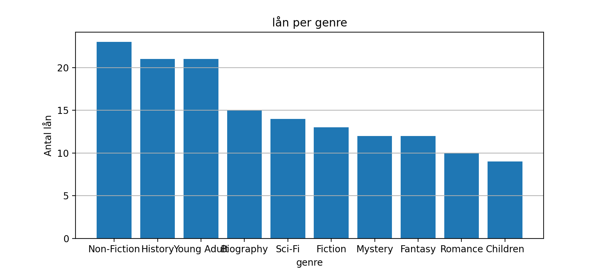
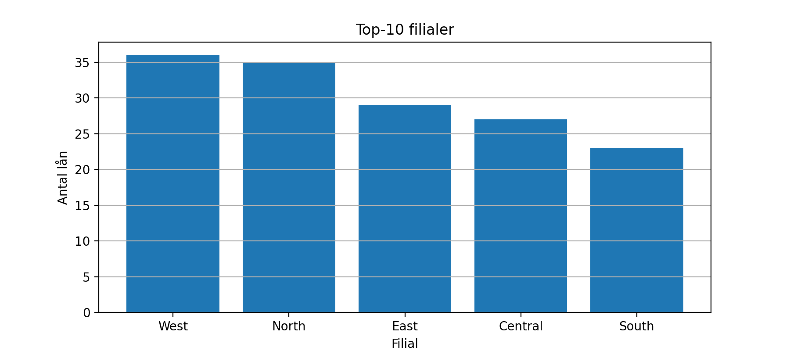
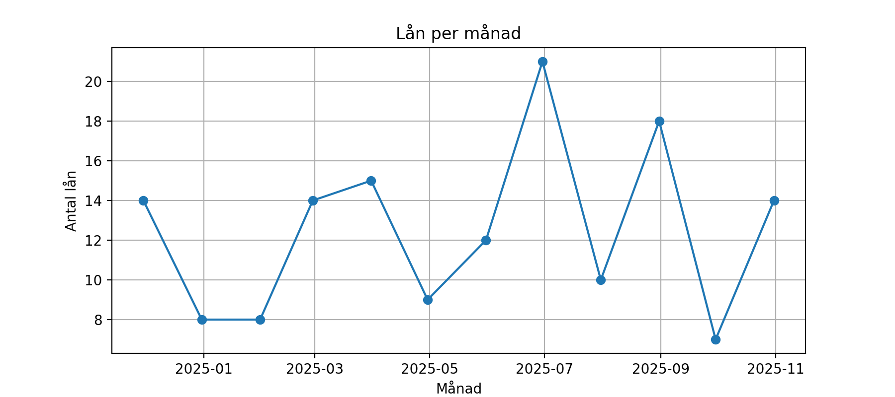
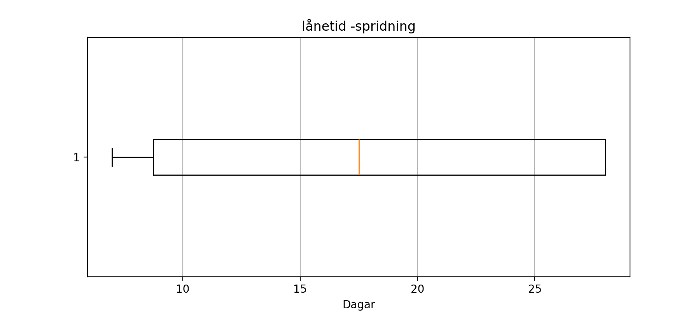

# EDA -Biblioteksutlåning

## Raport
## Nyckeltal(från notebooken ,efter lätt städning)
- **Totalt antal lån :**150
- **genomsnittlig lånetid :**17.7 dagar
- **Antal lån på övertid :**72.7

## Figurer 






## Tabeller (exporterade)
-  'data/pivot_branch_x_genre.csv'

## Slutsatser baserat på aktuell data
- **Topp- genrer :**1.Non-Fiction(23), 2.History(21), 3.Young Adult(21)
- **Topp-Filialer:**1.West (36), 2.North (35), 3.Est(29)

- **Säsongstopp :**2025-08 med **21** unika lån/mån
- **Policy-notering:**Övertidsandelen ligger på  **72.7%** följ upp med påminnelser


## Miljö
- **Python:**3.13.7
- **Paket:** 'Pandas' ,'Matplotlib'(se 'requirements.txt')

## kom ihåg 

```bash
#klona projektet
git clone  https://github.com/hamedre08-collab/EDA-biblioteket.git
cd library-eda

#skapa och aktivera virtuell miljö
python -m venv  .venv
#Windows Powershell
.venv\Scripts\Activate
#macOS/Linux
#source .venv/bin/activate

#installera beroende 
python -m pip install -r requirements.txt

```